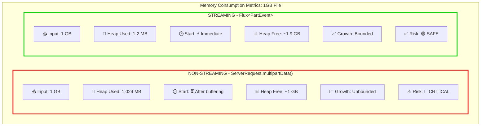

# Spring WebFlux.fn - Functional Endpoints

## Table of Contents
- [WebFlux Context and Introduction](#webflux-context-and-introduction)
- [WebFlux functional endpoints Overview](#webflux-functional-endpoints-overview)
   - [WebFlux.fn Main Components](#webfluxfn-main-components)
- [Routing Requests with RouterFunctions and RequestPredicates](#routing-requests-with-routerfunctions-and-requestpredicates)
- [Handling requests declaring HandlerFunctions](#handling-requests-declaring-handlerfunctions)
   - [Handling JSON requests](#handling-json-requests)
   - [Handling multipart/form-data requests in streaming fashion](#handling-multipartform-data-requests-in-streaming-fashion)
   - [How to consume a stream of Flux<DataBuffer>](#how-to-consume-a-stream-of-fluxdatabuffer)
- [How requests are handled internally by WebFlux.fn](#how-requests-are-handled-internally-by-webfluxfn)
   - [HandlerMapping - RouterFunctionMapping](#handlermapping---routerfunctionmapping)
   - [HandlerAdapter - HandlerFunctionAdapter](#handleradapter---handlerfunctionadapter)
   - [HandlerResultHandler - ServerResponseResultHandler](#handlerresulthandler---serverresponseresulthandler)
   - [How DispatcherHandler handle requests](#how-dispatcherhandler-handles-requests)

Most "how-to" articles just show how to implement something using the technology in context, and honestly, I don't think
there is nothing wrong about that, but most of the time we come across those articles, we are not just trying to implement something, we are trying to understand
how this specific library/framework/technology/logic works, that's why the goal of this article is not only to show how to
handle http requests using WebFlux functional framework, but also to show how those WebFlux.fn uses the components we define.
My goal is that by the end of this article you are not only able to add WebFlux dependency to your classpath
and create controllers using WebFlux.fn, but also understand what the framework is doing underneath, having all the tools needed
to reason about the best way of implementing the most appropriate solution for your problem.

At first we need to understand what we are aiming to achieve when saying "create a controller using functional webflux"

At first let's have a brief overview about Spring WebFlux, and what are its main components.

Then I will show how to implement a controller (request handler) using WebFlux.fn utility functions, how to create routes
matching specific requests paths, content-types, response-types, path variables and request parameters,
how to extract those properties from ServerRequest. Besides handling requests for application/json content type, I will
also show how to consume a multipart;form-data content-type, consuming all FilePartEvents through a reactive pipeline of
DataBuffers, consuming them reactively, without blocking the reactive pipeline and important hints for avoiding possible memory
leaks when consuming PooledDataBuffers.
---

## WebFlux Context and Introduction
Spring WebFlux like Spring MVC is designed around the front-controller pattern, where a central WebHandler, in this case
the `DispatcherHandler`, provides a shared logic for request processing and delegates the actual work to its configurable
components.

The `DispatcherHandler` discovers its delegate components from `ApplicationContext`, and is designed to be a Bean itself,
implementing `ApplicationContextAware` for access to the context in which it runs.

`DispatcherHandler` with a bean name of **webHandler** is discovered by `WebHttpHandlerBuilder`, and then is used by it to build
the WebHandler API request-processing chain.

This "request-processing" chain is constituted by multiple `WebExceptionHandlers`, multiple `WebFilters` and a single, central
`WebHandler` component. This chain is built by simply pointing to an `ApplicationContext` where **all components are auto-detected**.

It's important to understand the following distinction:
- `HttpHandler`: Simple goal of abstracting the use of different Http Servers, using server adapters (Netty, Jetty, Tomcat, etc)
- `WebHandler` API: Aims to provide a broader set of features, handling requests.

`WebHttpHandlerBuilder`, who builds the `WebHandler` API request-processing chain, can auto-detect the following beans:
- `WebExceptionHandler`: Handling exceptions that occur on WebFilters or on the target WebHandler during request processing.
- `WebFilter`: Intercepting requests and responses, providing pre- and post-processing logic.
- `WebHandler`: The central component of the request-processing chain, handling requests and returning responses (our DispatcherHandler).

The above context is important to understand what we are actually creating underneath when declaring RouterFunctions,
Predicates, HandlerFunctions, and other client-defined components from WebFlux.fn.

## WebFlux functional endpoints Overview

WebFlux exposes WebFlux.fn which is defined by Spring Documentation as:
> Spring WebFlux includes WebFlux.fn, a lightweight functional programming model in which functions are used to route and
> handle requests and contracts are designed for immutability.

Being a functional framework gives you more control about how requests are mapped to handlers, with minor improvement of not using
reflection, for example on `@RequestMapping` implementation of `HandlerMapping` where it filters @Controller annotated classes on [RequestMappingHandlerMapping](https://github.com/spring-projects/spring-framework/blob/main/spring-webflux/src/main/java/org/springframework/web/reactive/result/method/annotation/RequestMappingHandlerMapping.java#L157).

```java
@Override
protected boolean isHandler(Class<?> beanType) {
    return AnnotatedElementUtils.hasAnnotation(beanType, Controller.class);
}
```
But in summary, WebFlux.fn is an alternative to annotation-based programming model.

## WebFlux.fn Main Components

For handling requests with Spring WebFlux.fn we need two main components, a `HandlerFunction` and a `RouterFunction`.
The `HandlerFunction` will hold the logic that actually executes the request, and the `RouterFunction` takes a `ServerRequest` and
routes to a `HandlerFunction`.

A `HandlerFunction` is a functional interface that receives a `ServerRequest` and returns a `Mono<ServerResponse>`.

```java
@FunctionalInterface
public interface HandlerFunction<T extends ServerResponse> {
	
	Mono<T> handle(ServerRequest request);

}
```

A handler function can be written as a simple lambda, as the following example shows:
```java
HandlerFunction<ServerResponse> handlerFunction = request -> request
                .bodyToMono(String.class)
                .flatMap(body -> 
                        ServerResponse.ok().bodyValue(body)
                );
```

A `RouterFunction` is a functional interface that receives a ServerRequest and produces a HandlerFunction:
```java
@FunctionalInterface
public interface RouterFunction<T extends ServerResponse> {
    Mono<HandlerFunction<T>> route(ServerRequest request);
}
```

For creating a RouterFunction, spring provides a utility class called `RouterFunctions`, which is the central entrypoint to
Spring's functional web framework. The route function allows you to create a RouterFunction passing a RequestPredicate and a HandlerFunction:

```java
RouterFunction<ServerResponse> routerFunction = RouterFunctions.route(
        request -> request.method() == HttpMethod.GET && request.path().contains("hello"),
        request -> ServerResponse.ok().bodyValue("Hello World!")
);
```

RouterFunctions provides several utility functions that abstracts the creation of RequestPredicates, as an example you
can build more complex routing using path(), RouterFunctions.Builder interface and RequestPredicates utility class, which allows creating custom request predicates:
```java
RouterFunction<ServerResponse> routerFunction = RouterFunctions.route()
                .path("v1/statement", builder ->
                                builder
                                        .POST(accept(MULTIPART_FORM_DATA).and(contentType(MULTIPART_FORM_DATA)), transactionHandler::createFromMultipart)
                                        .POST(accept(APPLICATION_JSON).and(contentType(MULTIPART_FORM_DATA)), transactionHandler::createTransaction))
                .build();
```

## Routing Requests with RouterFunctions and RequestPredicates

To give you a broader overview of RouterFunctions and RequestPredicates utility functions let's analyze an example of declaring
a RouterFunction that handles transaction requests.

```java
@Configuration
public class TransactionRouter {

    private final TransactionHandler transactionHandler;

    public TransactionRouter(TransactionHandler transactionHandler) {
        this.transactionHandler = transactionHandler;
    }


    @Bean
    public RouterFunction<ServerResponse> transactionRouterFunction() {
        return route()
                .before(this::logRequest)
                .path("v1/statement", builder ->
                        builder
                                .POST(accept(MULTIPART_FORM_DATA).and(contentType(MULTIPART_FORM_DATA)), transactionHandler::createFromMultipart)
                                .nest(accept(APPLICATION_JSON), builder1 -> {
                                    builder1
                                            .GET(transactionHandler::getTransaction)
                                            .POST(transactionHandler::createTransaction)
                                            .build();
                                })
                ).after(this::logResponse)
                .build();
    }
}
```

As mentioned previously `DispatcherHandler` is designed to discover its delegate components from ApplicationContext (details will be explained further in this document),
therefore, we can declare RouterFunction Beans to be discovered by DispatcherHandler.

Analyzing our above example we can observe:
- We are calling `RouterFunctions.path()` which receives a String that will be used to create a path based RequestPredicate and a `Consumer<RouterFunctions.Builder>`;
- `RouterFunctions.Builder.POST` takes a `RequestPredicate`, in this example built using `RequestPredicates.accept()` and combined with `RequestPredicates.contentType()`, and a `HandlerFunction`;
   - This would be equivalent to adding a `@RequestMapping` at the class level of a `@Controller` annotated class, all the inner `RouterFunction` are mapped to the same
     'v1/statement' path-based `RequestPredicate`;
- `RouterFunctions.Builder` also expose a `nest()` function that receives a RequestPredicate and a `Consumer<RouterFunctions.Builder>`
  in this case we are using `RequestPredicates.accept()` to map requests with application/json content type to another RouterFunction;
- Using RouterFunctions.Builder.GET and POST we map to its respective HandlerFunctions declared under TransactionHandler class;

Based on the previous description we understand the following ServerRequest to HandlerFunction mapping:
- POST `'v1/statement'` | `content-type=multipart/form-data` - `transactionHandler::createFromMultipart`;
- POST `'v1/statement` | `content-type=application/json` = `transactionHandler::createTransaction`;
- GET `'v1/statement` | `content-type=application/json` = `transactionHandler::getTransaction`;

RouterFunctions also expose `before()` which is called before request is routed to its HandlerFunction and `after()` which is called after
request is processed by its HandlerFunction. This is a RouterFunction alternative to exposing a WebFilter Implementation Bean;

>Note: Router functions are evaluated in the order they are declared (composed), if the first one is not matched, the next one
> will be evaluated. Therefore, it makes sense to declare more specific routes before more general ones.


## Handling requests declaring HandlerFunctions
On this section we will learn how to consume a ServerRequest and produce a ServerResponse without breaking the reactive pipeline.
Let's go through the implementation of the three HandlerFunctions present on the RouterFunction declaration example:

### Handling JSON requests

As mentioned previously a HandlerFunction is a function that receives a ServerRequest and produces a reactive `Mono<ServerResponse>`.

```java
    public Mono<ServerResponse> getTransaction(ServerRequest request) {
        return ServerResponse.ok().bodyValue(
                request.queryParam("userId").map(
                        userId -> transactionDetailsPort.findByUserId(UUID.fromString(userId))
                ).orElse(Flux.empty())        
        );
    }
```
Taking into account that `transactionDetailsPort.findByUserId` returns a `Flux<TransactionDetails>` we can assign its value on
`bodyValue()` keeping the reactive pipeline. On this specific example we are retrieving a query parameter from ServerRequest
using `.queryParam()` method and passing an empty Flux as a fallback in case the parameter is not found.

Using a reactive database framework/library as R2DBC we can process the request without blocking the reactive pipeline. We
can apply the same concept for the POST create transaction request.

```java
    public Mono<ServerResponse> createTransaction(ServerRequest request) {
        return request.bodyToMono(TransactionDetails.class)
                .flatMap(transactionDetailsPort::upsert)
                .flatMap(transactionDetails ->  ServerResponse.ok().bodyValue(transactionDetails))
                .onErrorResume(ex -> ServerResponse.badRequest().bodyValue(ex.getMessage()));
        
    }
```

ServerRequest provides a way of serializing the body into a domain class with `ServerRequest.bodyToMono(Class)`.

Again, taking into account that `transactionDetailsPort.upsert` receives a TransactionDetails and produces a `Mono<TransactionDetails>`
the request can be handled preserving the reactive pipeline, mapping the produced TransactionDetails to a ServerResponse, and also
handling onError signals with `.onErrorResume` returning a proper bad request.

### Handling multipart/form-data requests in streaming fashion

ServerRequest provides an out-of-the-box way of consuming a multipart/form-data request:
```java
ServerRequest.multipartData();
```
Even though this returns a reactive MultiValueMap it does not stream the file consumption, collecting everything into memory all at once,
which can lead to memory exhaustion, especially if the file size is not predictable.



For scenarios where we have zero predictability regarding the size of the multipart file we are expecting to receive, we need
to stream the file consumption in order to avoid OutOfMemory exceptions.

Spring documentation provides an initial way of consuming multipart request body, which is serializing the request body to a `Flux<PartEvent>`.

#### What is a PartEvent?

Each multipart http request produces at least one PartEvent containing both headers and a buffer with the content of the part.
Form fields will produce a single FormPartEvent, and file uploads will produce one or more FilePartEvents. If the file is large
enough multiple FilePartEvent will be published.

Netty receives the body from the socket as a streaming of bytes (`ByteBuf`), `DefaultPartHttpMessageReader` is responsible for
consuming this array of bytes, casting to DataBuffers and producing FilePartEvents.
When calling `request.bodyToFlux(PartEvent.class)` Spring detects the appropriate HttpMessageReader to parse the request body.

Each FilePartEvent has a content which returns a DataBuffer. As mentioned by [Spring Framework Documentation](https://docs.spring.io/spring-framework/reference/core/databuffer-codec.html#databuffers-buffer)
DataBuffers are a representation of a byte buffer, which may be pooled or not.

The following example shows how to create a stream of PartEvent from ServerRequest body, checking whether the first emitted
signal is a FilePartEvent or not.

```java
    public Mono<ServerResponse> createFromMultipart(ServerRequest request) {

        Flux<PartEvent> allPartEvents = request.bodyToFlux(PartEvent.class);

        return ServerResponse.created(URI.create("")).body(
                allPartEvents.windowUntil(PartEvent::isLast)
                        .concatMap(part -> part.switchOnFirst((signal, partEvents) -> {
                            if(signal.hasValue()) { //will return true if it's an onNext signal
                                PartEvent event = signal.get(); //retrieves the item associated with this onNext signal

                                if(!signal.hasValue()) return Flux.empty();

                                if(event instanceof FilePartEvent) {
                                    Flux<DataBuffer> contents = partEvents.map(PartEvent::content);

                                    return streamParseCSV(contents)
                                            .buffer(500)
                                            .flatMap( transactions ->
                                                    Flux.fromStream(transactions.stream().map(transactionDetailsPort::upsert))
                                            ).flatMap(Function.identity());
                                }
                            }
                            else {
                                log.error("Unsupported operation");
                            }
                            return Flux.empty();
                        })),
                new ParameterizedTypeReference<TransactionDetails>() {}
        ).onErrorResume(e ->
                        ServerResponse.badRequest()
                                .bodyValue("Error saving transaction details %s".formatted(e.toString()))
        );
    }
```
Let's analyze each step of the above method:
1. First we collect the body to a publisher of PartEvent:
   - `Flux<PartEvent> allPartEvents = request.bodyToFlux(PartEvent.class);`
2. Inside a created ServerResponse method we call `.windowUntil(PartEvent::isLast)`
   - This will group the DataBuffers into multiple Flux windows delimited by the given predicate, in this case, the PartEvent::isLast, when a boundary is detected on chunk being processed, the FilePartEvent will be published with isLast == true, meaning all FilePartEvents for that part were published.
   - This allows us to work with windows that each belongs to the same single part.
3. Then we call `.concatMap(...)`
   - concatMap subscribes to each element in order, ensuring sequential subscription, very useful for file consumptions where the order matters;
4. Inside `.concatMap` we call `.switchOnFirst()` on the given window:
   - switchOnFirst operator allows us to inspect the first signal (usually the first element emitted by the source Flux) before deciding how we are going to consume the rest of the Flux;
   - It's very useful on our case, since we need to ensure the type of PartEvent is actually a FilePartEvent and not a FormPartEvent
5. If it's an instance of FilePartEvent:
   - We map the Flux<FilePartEvent> to a Flux<DataBuffer> by retrieving the PartEvent::content;
   - Then we pass the stream of DataBuffers to a method responsible to consume it and return a stream of TransactionDetails;
   - Then call transactionDetailsPort::upsert (R2DBC gateway that receives a TransactionDetails and produces a Mono<TransactionDetails>) to save the domain object on the database;

### How to consume a stream of `Flux<DataBuffer>`

Now let's move into `.streamParseCSV()`, which consumes the produced Flux<DataBuffer> preserving the reactive pipeline and without loading the whole file into memory.

```java
    private Flux<TransactionDetails> streamParseCSV(Flux<DataBuffer> contents) {
        return Flux.create(sink -> {
            PipedInputStream inputStream = new PipedInputStream(64 * 1024);
            PipedOutputStream outputStream;

            try {
                outputStream = new PipedOutputStream(inputStream);
            } catch (IOException e) {
                sink.error(e);
                return;
            }

            DataBufferUtils.write(contents, outputStream)
                    .doOnError(sink::error)
                    .doFinally( signalType -> {
                        try{ outputStream.close();} catch (IOException ignored) {}
                    })
                    .subscribe(DataBufferUtils.releaseConsumer());

            Schedulers.boundedElastic().schedule( () -> {
               try(InputStreamReader reader = new InputStreamReader(inputStream, StandardCharsets.UTF_8)) {
                   CsvParserSettings settings = new CsvParserSettings();
                   settings.setNumberOfRowsToSkip(4);
                   settings.setHeaderExtractionEnabled(true);
                   settings.setDelimiterDetectionEnabled(true, ';', ',');
                   settings.setLineSeparatorDetectionEnabled(true);

                   CsvParser parser = new CsvParser(settings);

                   ResultIterator<Record, ParsingContext> iterator = parser.iterateRecords(reader).iterator();
                   
                   while(iterator.hasNext() && !sink.isCancelled()) {
                       Record record = iterator.next();
                       try {
                           var transactionDetailsDto = TransactionDetailsDto.of(
                                   record.getString("Description"),
                                   record.getString("History"),
                                   record.getString("Transaction Date"),
                                   record.getString("Amound"),
                                      record.getString("Balance")
                           );

                           sink.next(
                                   new TransactionDetails(
                                           UUID.randomUUID(),
                                           Category.MARKET,
                                           transactionDetailsDto.getDescription(),
                                           transactionDetailsDto.getCost(),
                                           transactionDetailsDto.getTransactionDate()
                                   )
                           );
                       } catch (IllegalArgumentException ex) {
                           log.info("Expected fields were not present");
                       }
                   }

                   sink.complete();
               } catch (Throwable e) {
                   sink.error(e);
               }
            });

        }, FluxSink.OverflowStrategy.BUFFER);
    }
```

At this stage is important to understand that DataBuffers may be pooled. PooledDataBuffers are created off-heap, meaning they are not
affected by regular GC rounds, this is because Netty's `ByteBuf`, which uses reference count to manage the instances, gives full responsibility
of de-allocating the memory to the client (whoever is consuming the byte buffer). Netty's memory model is out of the scope of this article, but
the main reason for this approach is to avoid JVM memory copies, allowing the buffer to go from the kernel to the socket with fewer copies possible.

That being said, it's important to remember whenever you are consuming a DataBuffer or a stream of DataBuffers, you need to release the memory
allocated to this DataBuffer with `DataBufferUtils.release(DataBuffer buffer)` or `Flux<DataBuffer>.doOnNext(DataBufferUtils::releaseConsumer)`.

This is done using Piped Input and Output Streams, which act as a bridge between reactive and blocking paradigms.

Enough being said, let's go through the previous implementation:
1. We create one instance of `PipedInputStream` and `PipedOutputStream`, which allows inter-thread communication via a byte stream (creating a producer-consumer pattern).
   1. We need this because we are bridging a reactive, non-blocking data source (Flux<DataBuffer> contents) with a blocking CSV parsing API.
2. Using `DataBufferUtils.write` we have the ability to write the stream of DataBuffers to an OutputStream.
   1. ```java
        DataBufferUtils.write(contents, outputStream)
                    .doOnError(sink::error)
                    .doFinally( signalType -> {
                        try{ outputStream.close();} catch (IOException ignored) {}
                    })
                     .subscribe(DataBufferUtils.releaseConsumer());
       ```
   1. On the doFinally we close the outputStream, which notifies the PipedInputStream that the piped was closed.
   2. And we subscribe passing `DataBufferUtils.releaseConsumer()`, as mentioned previously, it's the consumer's responsibility to release possible PooledDataBuffers, it's very important to avoid memory leaks.
3. On a `BoundedElastic` Scheduler we schedule the InputStream consumption.
   1. This is done because the multipart-file is a CSV file and we are using a blocking CSV parser, doing this on a Schedulers Worker, which is a dedicated thread, allows us to consume the CSV file without blocking the main reactive event loop.
   2. This was also the main reason of why we are using a FluxSink, the sink will be used to emit the values from the Scheduler Worker, allowing us to emit the values from a different thread.
4. I won't get into details on how the CSV is being consumed, but it's using [Univocity](https://github.com/uniVocity/univocity-parsers/tree/master).
5. Univocity CsvParser provides a `.iterateRecords(InputStreamReader)` which allows us to traverse the InputStream.


## How requests are handled internally by WebFlux.fn

When you declare a RouterFunction passing a HandlerFunction, it defines routing logic that maps requests to HandlerFunctions. As mentioned previously,
DispatcherHandler will discover this routing logic using its delegate components.

[DispatcherHandler discovers three main components:](https://github.com/spring-projects/spring-framework/blob/main/spring-webflux/src/main/java/org/springframework/web/reactive/DispatcherHandler.java#L74)
```java
	private @Nullable List<HandlerMapping> handlerMappings;

	private @Nullable List<HandlerAdapter> handlerAdapters;

	private @Nullable List<HandlerResultHandler> resultHandlers;
```

| Component | Purpose | Main Implementations                                                                                                                                           | Key Details |
|-----------|---------|----------------------------------------------------------------------------------------------------------------------------------------------------------------|--------------|
| HandlerMapping | Map a request to a handler | • RequestMappingHandlerMapping (for @RequestMapping annotated methods)<br/>• RouterFunctionMapping (for functional endpoint routes)                            | Returns a Mono of the respective handler |
| HandlerAdapter | Help DispatcherHandler invoke the handler returned from HandlerMapping | • RequestMappingHandlerAdapter (for @RequestMapping annotated methods)<br/>• HandlerFunctionAdapter (for invoking HandlerFunctions from RouterFunctionMapping) | Shields DispatcherHandler from handler invocation details |
| HandlerResultHandler | Process HandlerResult and serialize the response | HttpMessageWriters and ViewResolvers                                                                                                                           | Handles response serialization after handler execution |


### HandlerMapping - RouterFunctionMapping

RouterFunctionMapping is a HandlerMapping implementation that discovers RouterFunctions.
It accepts a nullable RouterFunction<?> on its constructor, [but on Spring's default Bean definition is instantiated with a null value](https://github.com/spring-projects/spring-framework/blob/main/spring-webflux/src/main/java/org/springframework/web/reactive/config/WebFluxConfigurationSupport.java#L264).

```java
public class RouterFunctionMapping extends AbstractHandlerMapping implements InitializingBean {

	private @Nullable RouterFunction<?> routerFunction;
```

When no RouterFunction is passed at construction time, RouterFunctionMapping discovers RouterFunctions from ApplicationContext and [combines them with `RouterFunction::andOther`](https://github.com/spring-projects/spring-framework/blob/main/spring-webflux/src/main/java/org/springframework/web/reactive/function/server/support/RouterFunctionMapping.java#L124).
```java
protected void initRouterFunctions() {
		List<RouterFunction<?>> routerFunctions = routerFunctions();
		this.routerFunction = routerFunctions.stream().reduce(RouterFunction::andOther).orElse(null);
		logRouterFunctions(routerFunctions);
	}

	private List<RouterFunction<?>> routerFunctions() {
		return obtainApplicationContext()
				.getBeanProvider(RouterFunction.class)
				.orderedStream()
				.map(router -> (RouterFunction<?>) router)
				.collect(Collectors.toList());
	}
```

[RouterFunctionMapping overrides the getHandlerInternal which falls back to `HandlerMapping::getHandler`:](https://github.com/spring-projects/spring-framework/blob/main/spring-webflux/src/main/java/org/springframework/web/reactive/function/server/support/RouterFunctionMapping.java#L159)

```java
	@Override
	protected Mono<?> getHandlerInternal(ServerWebExchange exchange) {
		if (this.routerFunction == null) {
			return Mono.empty();
		}
		ServerRequest request = ServerRequest.create(exchange, this.messageReaders, getApiVersionStrategy());
		return this.routerFunction.route(request)
				.doOnNext(handler -> setAttributes(exchange.getAttributes(), request, handler));
	}
```

The HandlerFunction is returned by calling `.route` on the combined RouterFunction<?>; `setAttributes` sets valuable attributes on ServerWebExchange that later will be used by HandlerAdapter to invoke the handler being returned here.

### HandlerAdapter - HandlerFunctionAdapter

HandlerFunctionAdapter is an implementation of HandlerAdapter that supports receiving a HandlerFunction<?> and invokes it.

Declares only two methods, [supports (which return if the received parameter is an instance of HandlerFunction)](https://github.com/spring-projects/spring-framework/blob/main/spring-webflux/src/main/java/org/springframework/web/reactive/function/server/support/HandlerFunctionAdapter.java#L53) and handle (which actually receives the ServerWebExchange and the handler object).
```java
@Override
	public boolean supports(Object handler) {
		return handler instanceof HandlerFunction;
	}

	@Override
	public Mono<HandlerResult> handle(ServerWebExchange exchange, Object handler) {
		HandlerFunction<?> handlerFunction = (HandlerFunction<?>) handler;
		ServerRequest request = exchange.getRequiredAttribute(RouterFunctions.REQUEST_ATTRIBUTE);
		return handlerFunction.handle(request)
				.map(response -> new HandlerResult(handlerFunction, response, HANDLER_FUNCTION_RETURN_TYPE));
	}
```

[On `::handle`, the provided HandlerFunction is invoked by `handlerFunction.handle`](https://github.com/spring-projects/spring-framework/blob/main/spring-webflux/src/main/java/org/springframework/web/reactive/function/server/support/HandlerFunctionAdapter.java#L58) and the result is mapped to  HandlerResult, which is then returned.

This adapter is a bridge, the HandlerMapping provides the HandlerFunction, but the HandlerAdapter is responsible for invoking. This is needed because
DispatcherHandler is designed to work with various handler types, HandlerFunctionAdapter standardizes the invocation of HandlerFunctions into the
HandlerResult format that DispatcherHandler expects.

### HandlerResultHandler - ServerResponseResultHandler

ServerResponseResultHandler is a HandlerResultHandler implementation that supports receiving a `ServerResponse`.
```java
	@Override
	public boolean supports(HandlerResult result) {
		return (result.getReturnValue() instanceof ServerResponse);
	}

	@Override
	public Mono<Void> handleResult(ServerWebExchange exchange, HandlerResult result) {
		ServerResponse response = (ServerResponse) result.getReturnValue();
		Assert.state(response != null, "No ServerResponse");
		return response.writeTo(exchange, new ServerResponse.Context() {
			@Override
			public List<HttpMessageWriter<?>> messageWriters() {
				return messageWriters;
			}
			@Override
			public List<ViewResolver> viewResolvers() {
				return viewResolvers;
			}
		});
	}
```

[On `::supports` it checks if the result return value is an instance of ServerResponse.](https://github.com/spring-projects/spring-framework/blob/main/spring-webflux/src/main/java/org/springframework/web/reactive/function/server/support/ServerResponseResultHandler.java#L105) [On `handleResult` extracts the ServerResponse from the received HandlerResult
and writes the given response into the provided ServerWebExchange using `.writeTo(ServerWebExchange, Context)`.](https://github.com/spring-projects/spring-framework/blob/main/spring-webflux/src/main/java/org/springframework/web/reactive/function/server/support/ServerResponseResultHandler.java#L110)

HandlerResultHandlers decouple response processing from DispatcherHandler, allowing different result types.

### How DispatcherHandler handles requests

```java
@Override
	public Mono<Void> handle(ServerWebExchange exchange) {
		if (this.handlerMappings == null) {
			return createNotFoundError();
		}
		if (CorsUtils.isPreFlightRequest(exchange.getRequest())) {
			return handlePreFlight(exchange);
		}
		return Flux.fromIterable(this.handlerMappings)
				.concatMap(mapping -> mapping.getHandler(exchange))
				.next()
				.switchIfEmpty(createNotFoundError())
				.onErrorResume(ex -> handleResultMono(exchange, Mono.error(ex)))
				.flatMap(handler -> handleRequestWith(exchange, handler));
	}
```
[On `DispatcherHandler::handle`](https://github.com/spring-projects/spring-framework/blob/main/spring-webflux/src/main/java/org/springframework/web/reactive/DispatcherHandler.java#L138),
performs a map on the handlerMappings retrieving the handler calling `::getHandler`, taking into account RouterFunctionMapping, this will create a Flux of HandlerFunctions.

On the last operator `flatMap` [it calls this method called `handleRequestWith` passing the handler:](https://github.com/spring-projects/spring-framework/blob/main/spring-webflux/src/main/java/org/springframework/web/reactive/DispatcherHandler.java#L196)
```java
	private Mono<Void> handleRequestWith(ServerWebExchange exchange, Object handler) {
		if (ObjectUtils.nullSafeEquals(exchange.getResponse().getStatusCode(), HttpStatus.FORBIDDEN)) {
			return Mono.empty();  // CORS rejection
		}
		if (this.handlerAdapters != null) {
			for (HandlerAdapter adapter : this.handlerAdapters) {
				if (adapter.supports(handler)) {
					Mono<HandlerResult> resultMono = adapter.handle(exchange, handler);
					return handleResultMono(exchange, resultMono);
				}
			}
		}
		return Mono.error(new IllegalStateException("No HandlerAdapter: " + handler));
	}
```

This method traverses the list of `handlerAdapters` using the `HandlerAdapter::supports` to retrieve an implementation that supports the given handler.

In our WebFlux.fn case it would be here that the `HandlerFunctionAdapter` would be discovered and then used to retrieve the result `adapter.handle(exchange, handler)`.

Once the result is retrieved, [it calls this `handleResultMono`](https://github.com/spring-projects/spring-framework/blob/main/spring-webflux/src/main/java/org/springframework/web/reactive/DispatcherHandler.java#L160), the same method called on the `onErrorResume` within `handle` method.

```java
	private Mono<Void> handleResultMono(ServerWebExchange exchange, Mono<HandlerResult> resultMono) {
		if (this.handlerAdapters != null) {
			for (HandlerAdapter adapter : this.handlerAdapters) {
				if (adapter instanceof DispatchExceptionHandler exceptionHandler) {
					resultMono = resultMono.onErrorResume(ex2 -> exceptionHandler.handleError(exchange, ex2));
				}
			}
		}
		return resultMono.flatMap(result -> {
			Mono<Void> voidMono = handleResult(exchange, result, "Handler " + result.getHandler());
			DispatchExceptionHandler exceptionHandler = result.getExceptionHandler();
			if (exceptionHandler != null) {
				voidMono = voidMono.onErrorResume(ex ->
						exceptionHandler.handleError(exchange, ex).flatMap(result2 ->
								handleResult(exchange, result2, "Exception handler " +
										result2.getHandler() + ", error=\"" + ex.getMessage() + "\"")));
			}
			return voidMono;
		});
	}

	private Mono<Void> handleResult(
			ServerWebExchange exchange, HandlerResult handlerResult, String description) {

		if (this.resultHandlers != null) {
			for (HandlerResultHandler resultHandler : this.resultHandlers) {
				if (resultHandler.supports(handlerResult)) {
					description += " [DispatcherHandler]";
					return resultHandler.handleResult(exchange, handlerResult).checkpoint(description);
				}
			}
		}
		return Mono.error(new IllegalStateException(
				"No HandlerResultHandler for " + handlerResult.getReturnValue()));
	}
```

On these two methods, it traverses the list of HandlerResultHandler checking which implementation supports the given handlerResult, in our case the result type would be
a ServerResponse, then `ServerResponseResultHandler` would match the validation, then calls `resultHandler.handleResult(exchange, handlerResult).checkpoint(description)`
writing the given response to the exchange.

HandlerAdapter [can be an instance of DispatchExceptionHandler](https://github.com/spring-projects/spring-framework/blob/main/spring-webflux/src/main/java/org/springframework/web/reactive/DispatchExceptionHandler.java#L41) in order to map a Throwable to a HandlerResult, `handleResultMono` checks if there's any adapter that is an instance of DispatchExceptionHandler,
if so calls `DispatchExceptionHandler::handleError` on an `onErrorResume` operator:
```java
if (this.handlerAdapters != null) {
    for (HandlerAdapter adapter : this.handlerAdapters) {
        if (adapter instanceof DispatchExceptionHandler exceptionHandler) {
            resultMono = resultMono.onErrorResume(ex2 -> exceptionHandler.handleError(exchange, ex2));
        }
    }
}
```

This shows how WebFlux.fn components such as RouterFunction, HandlerFunction, ServerRequest, ServerResponse are actually handled
internally on Spring WebFlux (DispatcherHandler), in summary each DispatcherHandler delegate component has an implementation for its
corresponding WebFlux.fn component, extracting those components from ApplicationContext.

We can also observe that if compared to `RequestMappingHandlerMapping`, not having the overhead of discovering the handlers using reflection, makes the handlers way simpler.

